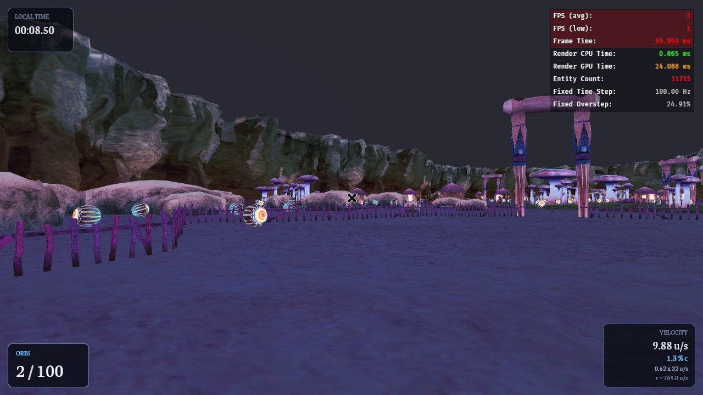
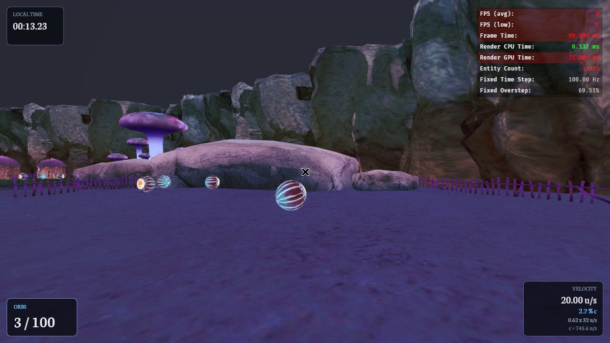
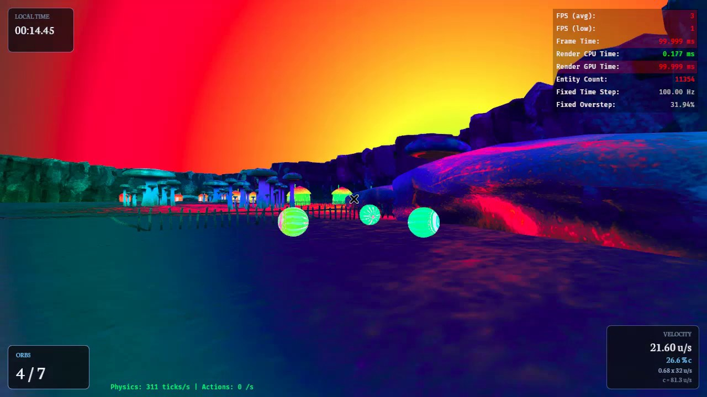
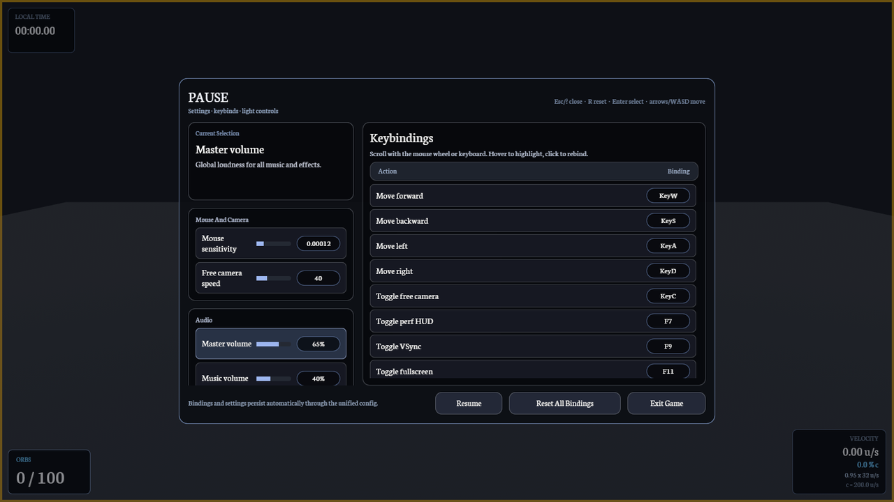
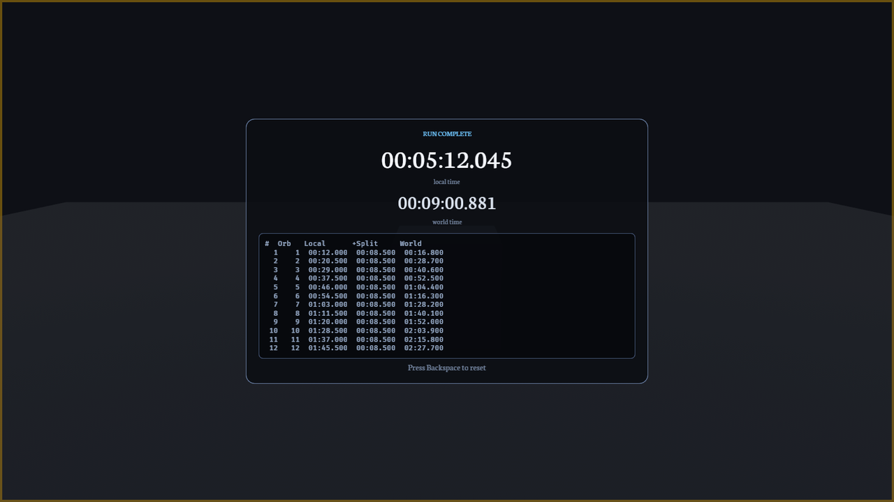
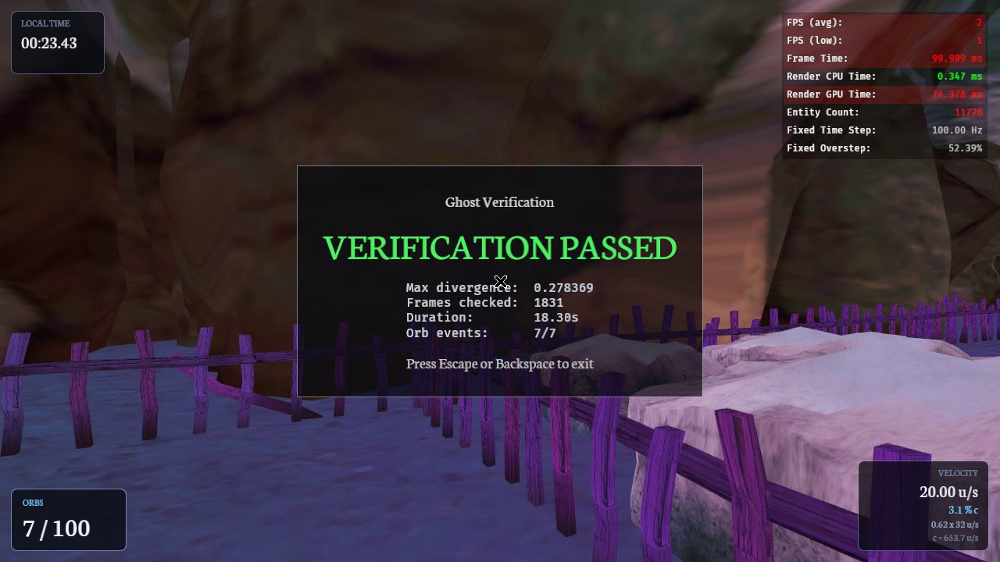

# Open SSOL

**Open SSOL** is an open-source clone of [*A Slower Speed of Light*](https://gamelab.mit.edu/games/a-slower-speed-of-light/) (MIT Game Lab): collect orbs that lower the speed of light, then finish through the white arch.

It aims for **identical relativistic physics** and **near-identical collision physics**, with a **cleaner UI**, plus extras the original does not ship:

- **Ghosts / replays** — record runs, verify determinism, and review trajectories
- **Headless mode** — scriptable, windowless sims for AI training and evaluation

<p align="center">
  
</p>

## Screenshots

| Gameplay | Relativistic effects |
| --- | --- |
|  |  |

| Pause menu | Finish screen |
| --- | --- |
|  |  |

<p align="center">
  <br/>
  <em>Ghost verification: replay a recorded run and check path fidelity.</em>
</p>

## Download

Get a prebuilt binary from [Releases](https://github.com/XertroV/ssol-simulator/releases):

- `Windows x86_64`
- `Linux x86_64`
- `macOS arm64`

## Quick Start

1. Download the archive for your platform.
2. Extract it fully.
3. Open the extracted folder.
4. Launch the game from inside that folder.

**Important:** keep the executable next to the bundled `assets/` directory. If you move only the executable, the game cannot load its data.

## Goal

Collect all visible orbs in the level. Each orb lowers the speed of light (`c`), so motion and vision become more relativistic as you progress.

After every orb is collected, the white finish arch becomes active. Pass through it (or click when prompted) to finish the run.

## Default Controls

| Input | Action |
| --- | --- |
| `W` `A` `S` `D` | Move |
| Mouse | Look |
| `Escape` | Pause / resume (settings & keybinds) |
| `F11` | Fullscreen |
| `Backspace` | Reset the run |
| `C` | Free camera |
| `Space` / `Left Shift` | Free camera up / down |
| `F7` | Performance HUD |

Keybinds and most settings are editable from the pause menu (they persist on disk).

## In-Game Settings

From the pause menu:

- Mouse sensitivity and free-camera speed
- Master, music, and SFX volume
- Fullscreen, VSync, performance HUD
- Physics gizmos and desaturation

## For Developers & AI Training

Build from source (Rust / Bevy). Useful flags (see `src/main.rs` and `AGENTS.md`):

| Flag | Purpose |
| --- | --- |
| `--headless --no-audio` | No window / no audio — training & CI |
| `--speed N` | Simulation speed multiplier |
| `--num-orbs N` | Curriculum orb count |
| `--verify-ghost PATH` | Replay a `.ghost` recording and check positions |
| `--ghost-test` | Record a bot run, then verify it |
| `--scripted-baseline` | Scripted teacher / train harness (no `--features ai` required) |

Python training lives under `python/` (uv project). Optional Cargo feature `ai` enables the ZMQ bridge and AI debug UI; release builds leave it off.

```bash
# Dev run
cargo run -- --no-audio

# Headless smoke (example)
cargo run --release -- --headless --no-audio --speed 50 --scripted-baseline --num-orbs 3
```

## Notes

- Releases are archives, not single standalone executables — launch from the extracted folder.
- `assets/` must sit beside the binary.
- This project is a fan remake / research port; it is not affiliated with MIT Game Lab. *A Slower Speed of Light* is their original game.

## Credits

*A Slower Speed of Light* is an original MIT Game Lab project. Open SSOL is an independent open-source clone/port and is not affiliated with MIT. Level art, audio, and the original concept belong to their respective authors.
